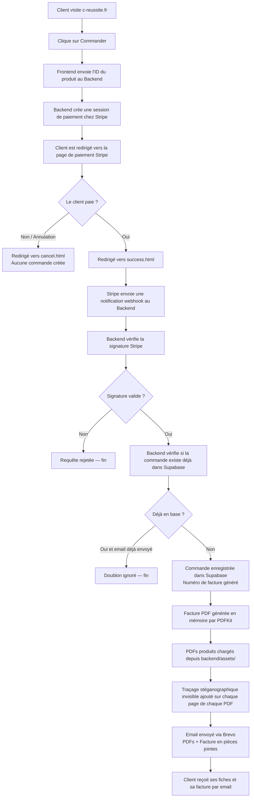

# C'Réussite — Documentation complète du site

> Ce document explique comment fonctionne le site C'Réussite, quels outils sont utilisés, comment les commandes sont traitées, et comment maintenir ou faire évoluer le projet. Il est rédigé pour une lecture sans connaissance technique particulière.

---

## Table des matières

1. [Vue d'ensemble en une phrase](#1-vue-densemble-en-une-phrase)
2. [Architecture globale — les grandes pièces du puzzle](#2-architecture-globale)
3. [Stack technique — tableau récapitulatif](#3-stack-technique)
4. [Flux complet d'une commande — étape par étape](#4-flux-complet-dune-commande)
5. [Les produits — où ils sont définis et comment les modifier](#5-les-produits)
6. [La livraison des produits](#6-la-livraison-des-produits)
7. [La facturation](#7-la-facturation)
8. [La base de données](#8-la-base-de-données)
9. [Exporter les commandes en Excel](#9-exporter-les-commandes-en-excel)
10. [Services externes et leurs coûts](#10-services-externes-et-leurs-coûts)
11. [Déploiement et maintenance](#11-déploiement-et-maintenance)
12. [Diagramme du flux de commande](#12-diagramme-du-flux-de-commande)
13. [FAQ](#13-faq)
14. [Recommandations prioritaires](#14-recommandations-prioritaires)

---

## 1. Vue d'ensemble en une phrase

Le site C'Réussite est une boutique en ligne qui vend des fiches de révision en PDF : le client paie en ligne via Stripe, et reçoit automatiquement ses fichiers par email dans les secondes qui suivent, sans aucune intervention manuelle.

---

## 2. Architecture globale

Le site est découpé en plusieurs services indépendants qui communiquent entre eux. Voici le rôle de chacun.

### Le frontend — ce que voit le client

Le site visible à l'adresse **c-reussite.fr** est un ensemble de pages HTML statiques hébergées gratuitement sur **GitHub Pages**. Ce sont des fichiers simples (HTML, CSS, JavaScript) qui ne nécessitent pas de serveur puissant. Quand un client clique sur "Commander", le site envoie une demande au backend.

Fichiers principaux :
- `docs/index.html` — la page d'accueil avec les produits
- `docs/success.html` — la page affichée après un paiement réussi
- `docs/cancel.html` — la page affichée si le client annule
- `docs/cgv.html` — les conditions générales de vente
- `docs/js/payment.js` — le script qui déclenche le paiement

### Le backend — le moteur invisible

Le backend est un programme informatique hébergé sur **Railway**. Il ne s'affiche pas à l'écran mais c'est lui qui fait tout le travail : créer la session de paiement Stripe, recevoir la confirmation du paiement, enregistrer la commande, générer la facture, et envoyer l'email.

### Stripe — le système de paiement

Stripe est le service qui gère le paiement par carte bancaire. Il est certifié PCI-DSS (norme de sécurité bancaire internationale). Les coordonnées bancaires des clients ne transitent jamais par le site ou le backend : elles sont saisies directement sur une page sécurisée hébergée par Stripe.

Une fois le paiement validé, Stripe envoie une notification automatique au backend (appelée **webhook**) pour dire : "ce client vient de payer pour ce produit".

### Supabase — la base de données

Supabase est une base de données en ligne (équivalent d'un tableur ultra-sécurisé et automatisé). Chaque commande validée y est enregistrée avec toutes ses informations : email du client, produit acheté, montant, numéro de facture, date.

### Brevo — l'envoi d'emails

Brevo (anciennement Sendinblue) est le service qui envoie les emails transactionnels. C'est lui qui délivre l'email de confirmation avec les PDFs en pièce jointe. Il garantit un meilleur taux de délivrabilité que l'envoi depuis une simple boite Gmail.

### PDFKit et pdf-lib — la génération de factures

Ce sont deux outils installés dans le backend qui permettent de créer des fichiers PDF directement dans le code :
- **PDFKit** génère la facture à la volée (en mémoire, sans la sauvegarder sur disque)
- **pdf-lib** intègre un tracé stéganographique invisible dans les PDFs produits pour les protéger contre le partage illégal

### GitHub Pages et Railway — les hébergeurs

- **GitHub Pages** héberge le site visible (les pages HTML) — gratuit, sans limite de trafic raisonnable
- **Railway** héberge le backend (le moteur) — gratuit jusqu'à un certain volume d'utilisation, puis payant

---

## 3. Stack technique

| Composant | Rôle | Où dans le repo | Gratuit aujourd'hui ? | Peut devenir payant ? | Remarque |
|---|---|---|---|---|---|
| JavaScript (Node.js) | Langage du backend | `backend/` | Oui | Non | Standard et très répandu |
| HTML / CSS / JS | Langage du frontend | `docs/` | Oui | Non | Aucun framework — site léger |
| Express.js | Cadre du serveur backend | `backend/server.js` | Oui | Non | Bibliothèque open source |
| Stripe | Paiement par carte | `backend/routes/checkout.js` | Gratuit à l'usage (2,9% + 0,30€/transaction) | Oui — commissions sur chaque vente | Incontournable pour le paiement |
| Supabase | Base de données | `backend/services/db.js` | Oui (plan gratuit) | Oui au-delà de 500 Mo / 50 000 requêtes/mois | Très généreux pour un petit volume |
| Brevo | Envoi d'emails | `backend/services/mailer.js` | Oui (300 emails/jour gratuits) | Oui si dépassement du quota | Suffisant pour un démarrage |
| PDFKit | Génération de la facture PDF | `backend/services/invoice.js` | Oui | Non | Open source |
| pdf-lib | Traçage stéganographique des PDFs produits | `backend/services/mailer.js` | Oui | Non | Open source |
| GitHub Pages | Hébergement du site visible | `docs/` + `.github/workflows/` | Oui | Non (usage raisonnable) | Très fiable |
| Railway | Hébergement du backend | `backend/` | Oui (plan Hobby) | Oui si fort trafic | ~5$/mois au-delà du plan gratuit |
| GitHub Actions | CI/CD (déploiement automatique) | `.github/workflows/deploy.yml` | Oui | Non (usage raisonnable) | Déploie le site à chaque mise à jour |
| Supabase Migrations | Gestion du schéma de base de données | `supabase/migrations/` | Oui | Non | Appliquées automatiquement |
| Domaine c-reussite.fr | Adresse du site | `docs/CNAME` | Non — renouvellement annuel | Toujours payant | ~10-15€/an selon le registrar |

---

## 4. Flux complet d'une commande

Voici ce qui se passe exactement, de l'instant où un client clique sur "Commander" jusqu'à la réception de l'email.

| Étape | Ce qui se passe | Service impliqué | Données créées / mises à jour | Point de vigilance |
|---|---|---|---|---|
| 1. Clic sur "Commander" | Le bouton est désactivé, le texte change en "Redirection…" | Frontend (navigateur) | Aucune | Si JavaScript est désactivé dans le navigateur, le bouton ne fonctionne pas |
| 2. Demande de session de paiement | Le frontend envoie l'identifiant du produit (`maths`, `physique` ou `bundle`) au backend | Frontend → Backend | Aucune en base | Si le backend est hors ligne, une alerte s'affiche |
| 3. Création de la session Stripe | Le backend crée une session de paiement chez Stripe avec le nom du produit et le prix | Backend → Stripe | Session Stripe créée (identifiant unique) | Le produit doit exister dans `products.json` |
| 4. Redirection vers Stripe | Le client est redirigé vers la page de paiement sécurisée de Stripe | Stripe | Aucune | La page de paiement est hébergée par Stripe, pas par le site |
| 5. Saisie des coordonnées bancaires | Le client saisit ses informations de carte sur la page Stripe | Stripe | Aucune — les données bancaires ne touchent jamais le backend | Stripe gère la sécurité bancaire |
| 6. Paiement validé ou refusé | Si le paiement réussit, Stripe redirige vers `success.html`. Si refusé ou annulé, vers `cancel.html` | Stripe → Frontend | Aucune en base à ce stade | Le paiement peut être refusé par la banque |
| 7. Notification webhook | Stripe envoie une notification secrète au backend pour confirmer le paiement | Stripe → Backend | Aucune encore | Si le backend ne répond pas, Stripe retentera automatiquement |
| 8. Vérification de la signature | Le backend vérifie que la notification vient bien de Stripe (et pas d'un pirate) | Backend | Aucune | Sans cette vérification, un faux paiement pourrait déclencher une livraison |
| 9. Vérification des doublons | Le backend vérifie si cette session Stripe est déjà en base de données | Backend → Supabase | Lecture seule | Protège contre les doubles livraisons si Stripe renvoie la notification |
| 10. Enregistrement de la commande | Si nouvelle commande : insertion en base avec email, produit, montant, numéro de facture | Backend → Supabase | Ligne créée dans la table `orders` | Le numéro de facture est généré automatiquement au format `2026-001` |
| 11. Génération de la facture | Le backend crée un PDF de facture en mémoire (il n'est pas sauvegardé sur disque) | Backend (PDFKit) | PDF en mémoire temporaire | La facture n'est pas archivée — voir recommandations |
| 12. Traçage stéganographique des PDFs | L'email de l'acheteur est inscrit en texte invisible (opacité quasi nulle) à 5 endroits par page, dans le flux de contenu du PDF | Backend (pdf-lib) | PDF modifié en mémoire | Les fichiers sources dans `backend/assets/` ne sont pas modifiés |
| 13. Envoi de l'email | L'email est envoyé avec les PDFs produits et la facture en pièces jointes | Backend → Brevo | Email envoyé à l'acheteur | Si Brevo est indisponible, le backend répond `500` à Stripe qui retentera |
| 14. Fin | Le client reçoit son email avec ses fichiers | Email | Aucune | — |

### Ce qui se passe si le paiement échoue

Si la carte est refusée, Stripe ne déclenche pas de webhook et aucune commande n'est créée en base. Le client est simplement renvoyé vers `cancel.html`. Aucun email n'est envoyé, aucune donnée n'est enregistrée.

### Ce qui se passe si Stripe envoie deux fois la même notification

Le backend vérifie d'abord si l'identifiant de session Stripe existe déjà en base de données. Si oui, et que l'email a déjà été envoyé, la notification est ignorée. Si l'email n'avait pas encore été envoyé (panne momentanée lors du premier essai), il est renvoyé. C'est ce qu'on appelle l'**idempotence** : même en cas de répétition, le client ne reçoit pas deux fois son email.

---

## 5. Les produits

### Catalogue actuel

Le site vend actuellement 3 produits, tous définis dans un seul fichier : [`docs/content/products.json`](docs/content/products.json).

| Produit | Identifiant | Prix | PDF(s) associé(s) | Fichier source |
|---|---|---|---|---|
| Fiches Maths Terminale Spécialité | `maths` | 14,99 € | `fiches-maths.pdf` | `docs/content/products.json` |
| Fiches Physique-Chimie Terminale Spécialité | `physique` | 14,99 € | `fiches-physique-chimie.pdf` | `docs/content/products.json` |
| Pack Maths + Physique-Chimie | `bundle` | 24,99 € | `fiches-maths.pdf` + `fiches-physique-chimie.pdf` | `docs/content/products.json` |

### `products.json` — la source de vérité

Ce fichier est **la seule source de vérité** pour les produits. Il est lu à la fois par le frontend (pour afficher les prix et boutons) et par le backend (pour créer la session de paiement et identifier les PDFs à envoyer). Modifier ce fichier suffit pour mettre à jour les deux.

Voici sa structure actuelle :

```json
[
  {
    "id": "maths",
    "name": "Fiches Maths Terminale Spécialité",
    "price": 1499,
    "pdf_files": ["fiches-maths.pdf"]
  }
]
```

> **Important** : le prix est en **centimes**. `1499` = 14,99 €. `2499` = 24,99 €.

### Comment modifier un produit

| Action | Ce qu'il faut faire | Risque si mal fait |
|---|---|---|
| Changer le prix | Modifier `price` dans `products.json` (en centimes) | Le client paie le mauvais prix |
| Changer le nom affiché | Modifier `name` dans `products.json` | Le nom sur la facture change aussi |
| Ajouter un nouveau produit | Ajouter un objet dans le tableau JSON avec un `id` unique, un `name`, un `price` et un ou plusieurs `pdf_files` | Si `pdf_files` ne correspond pas à un fichier dans `backend/assets/`, l'email échouera |
| Ajouter un PDF produit | Déposer le fichier dans `backend/assets/` ET l'ajouter dans `pdf_files` de `products.json` | Si le fichier est absent de `backend/assets/`, l'email échoue au moment de la livraison |
| Supprimer un produit | Retirer l'objet du tableau JSON | Si un lien direct vers ce produit existe quelque part, il déclenchera une erreur |

### Comment faire évoluer le catalogue sans casser le site

1. Ne jamais changer l'`id` d'un produit existant (les anciennes commandes en base de données y font référence)
2. Toujours déposer le fichier PDF dans `backend/assets/` avant de l'ajouter dans `products.json`
3. Tester le flux complet (paiement de test Stripe) après toute modification

---

## 6. La livraison des produits

La livraison est entièrement **automatique**. Dès que le paiement est confirmé, les fichiers sont envoyés par email sans aucune intervention.

| Type de livraison | Automatique ou manuel | Service utilisé | Déclencheur | Ce que reçoit le client |
|---|---|---|---|---|
| Fiches PDF produit(s) | Automatique | Brevo (email) | Paiement Stripe validé | PDF(s) en pièce(s) jointe(s), avec traçage stéganographique |
| Facture PDF | Automatique | Brevo (email) | Même déclencheur | Facture en pièce jointe |

### Ce que contient l'email

- Objet : `Tes fiches sont là — [nom du produit]`
- Corps : message de remerciement avec le nom du produit et le numéro de facture
- Pièces jointes :
  - Le ou les PDF(s) du produit acheté (avec traçage stéganographique invisible)
  - La facture au format PDF (numérotée `facture-2026-001.pdf`)

### La protection anti-partage (stéganographie)

Chaque PDF produit est modifié avant envoi. Le fichier envoyé au client est visuellement identique à l'original, mais l'email de l'acheteur y est inscrit de façon invisible à deux niveaux :

**Niveau 1 — Métadonnées du fichier** (supprimables avec un outil en ligne)
- Champ "Auteur" : `Acheté par : Prénom Nom <email@exemple.com>`
- Champs "Mots-clés" et "Sujet" : email et nom de l'acheteur

**Niveau 2 — Stéganographie dans le contenu des pages** (résiste à la suppression des métadonnées)
- L'email de l'acheteur est inscrit **5 fois par page** en texte blanc, taille 4pt, opacité 0,4%
- Complètement invisible à l'oeil nu et à l'impression
- Physiquement présent dans le flux de contenu PDF — aucun outil de "nettoyage de métadonnées" n'y touche
- Détectable en faisant `Ctrl+A` (sélectionner tout) dans Adobe Acrobat : l'email apparaît dans la sélection

**Pour identifier l'origine d'un fichier partagé illégalement** : ouvrir le PDF dans Adobe Acrobat, faire `Ctrl+A`, copier le texte dans un éditeur — l'email de l'acheteur est lisible 5 fois par page. Croiser avec la table `orders` dans Supabase.

Les fichiers sources dans `backend/assets/` ne sont jamais modifiés.

### Ajouter un nouveau produit à livrer

1. Déposer le fichier PDF final dans `backend/assets/`
2. Ajouter le nom du fichier dans `pdf_files` du produit concerné dans `products.json`
3. Pousser les modifications sur GitHub (le redéploiement est automatique)

---

## 7. La facturation

| Élément de facturation | Détail | Généré par | Stocké où | Envoyé à qui |
|---|---|---|---|---|
| Numéro de facture | Format `AAAA-NNN` (ex: `2026-001`), séquentiel par année | Backend (`db.js`) | Supabase (champ `invoice_number`) | Dans le corps et en pièce jointe de l'email |
| Nom du vendeur | "C'Réussite" | Backend (`invoice.js`) | Non stocké | Dans le PDF facture |
| Email vendeur | Valeur de `FROM_EMAIL` (variable d'environnement Railway) | Backend | Non stocké | Dans le PDF facture |
| Adresse du site | `c-reussite.fr` | Backend (`invoice.js`) | Non stocké | Dans le PDF facture |
| Facturé à | Email de l'acheteur (depuis Stripe) | Backend | Non stocké séparément | Dans le PDF facture |
| Désignation | Nom du produit acheté | Backend | Non stocké séparément | Dans le PDF facture |
| Prix TTC | Montant payé, en euros, format `XX,XX €` | Backend | Stocké en centimes dans Supabase | Dans le PDF facture |
| Mention TVA | "TVA non applicable – article 293 B du CGI" | Backend (`invoice.js`) | Non stocké | Dans le PDF facture |
| Mention acquittement | "Facture acquittée" | Backend (`invoice.js`) | Non stocké | Dans le PDF facture |

### Comment la facture est créée

La facture est générée automatiquement par le backend au moment du traitement de chaque commande. Elle est créée **en mémoire** (pas sauvegardée sur disque), puis immédiatement attachée à l'email et envoyée. Une fois l'email parti, elle n'est plus conservée nulle part côté serveur.

### Point de vigilance : les factures ne sont pas archivées

La facture n'existe que dans l'email envoyé au client. Si le client perd son email, la facture est perdue pour lui. Pour Camille, il est possible de recréer une facture à partir des données en base (email, produit, montant, date, numéro de facture), mais cela nécessite une intervention manuelle ou un outil à développer. Voir la section Recommandations.

---

## 8. La base de données

La base de données contient **une seule table** : `orders` (les commandes).

### Structure de la table `orders`

| Champ | Rôle | Type de donnée | Obligatoire ? | Pourquoi c'est important |
|---|---|---|---|---|
| `id` | Identifiant unique de la commande | UUID (code aléatoire) | Oui (automatique) | Permet d'identifier chaque commande de façon unique |
| `email` | Email de l'acheteur | Texte | Oui | Pour retrouver les commandes d'un client |
| `product_id` | Identifiant du produit acheté (`maths`, `physique`, `bundle`) | Texte | Oui | Pour savoir ce qui a été acheté |
| `amount` | Montant payé | Entier en centimes (ex: `1499`) | Oui | Pour la comptabilité |
| `stripe_session_id` | Identifiant unique de la session Stripe | Texte unique | Oui | **Clé d'idempotence** — empêche les doublons si Stripe renvoie la notification |
| `invoice_number` | Numéro de facture (ex: `2026-001`) | Texte | Oui | Pour la numérotation comptable |
| `created_at` | Date et heure de la commande | Date avec fuseau horaire | Oui (automatique) | Pour les exports et la comptabilité |

> Le champ `email_sent` est mis à `true` dans la base dès que l'email est envoyé avec succès. Si Stripe renvoie la notification avant que l'email soit parti (panne momentanée de Brevo), le backend renvoie l'email. Si l'email était déjà parti, la notification est ignorée. Les deux protections fonctionnent ensemble : le champ `stripe_session_id` UNIQUE empêche les doublons en base, et `email_sent` empêche les doubles livraisons.

### Comment les doublons sont évités

Le champ `stripe_session_id` est défini comme `UNIQUE` dans la base de données. Cela signifie que si Stripe envoie deux fois la même notification, la deuxième tentative d'insertion sera bloquée par la base de données elle-même, indépendamment du code. C'est une protection fiable.

### Index de performance

Trois index ont été créés pour accélérer les recherches fréquentes :
- Sur `email` — pour retrouver toutes les commandes d'un client
- Sur `stripe_session_id` — pour la vérification d'idempotence
- Sur `invoice_number` — pour retrouver une facture

### Données critiques à préserver

Toutes les données de la table `orders` sont critiques : elles constituent le registre comptable des ventes. Il est fortement recommandé d'activer les sauvegardes automatiques Supabase (disponibles sur le plan gratuit, conservation 7 jours).

---

## 9. Exporter les commandes en Excel

La base de données Supabase permet d'exporter les commandes à tout moment. Voici trois approches selon le niveau de confort souhaité.

| Méthode | Complexité | Temps gagné | Risque d'erreur | Recommandée ? |
|---|---|---|---|---|
| Export manuel depuis l'interface Supabase | Faible — quelques clics | Moyen — quelques minutes | Très faible | Oui, pour commencer |
| Export CSV via une requête SQL dans Supabase | Faible — copier-coller une requête | Élevé — fichier immédiatement prêt | Faible | Oui, dès que les volumes augmentent |
| Export automatisé via une route `/api/export` | Élevée — nécessite du développement | Très élevé — un clic suffit | Très faible | Recommandé à terme |

### Méthode 1 — Export manuel depuis l'interface Supabase (sans code)

1. Aller sur [https://supabase.com/dashboard](https://supabase.com/dashboard)
2. Ouvrir le projet C'Réussite
3. Cliquer sur **Table Editor** dans le menu de gauche
4. Sélectionner la table **orders**
5. Cliquer sur le bouton **Export** (en haut à droite)
6. Choisir le format CSV
7. Ouvrir le fichier CSV dans Excel ou Google Sheets

### Méthode 2 — Export via une requête SQL (semi-automatique)

Dans Supabase, ouvrir l'éditeur SQL (**SQL Editor**) et coller la requête suivante :

```sql
SELECT
  invoice_number  AS "N° Facture",
  created_at      AS "Date",
  email           AS "Email client",
  product_id      AS "Produit",
  amount / 100.0  AS "Montant (€)"
FROM orders
ORDER BY created_at DESC;
```

Cliquer sur **Run**, puis sur **Export CSV**. Ce fichier s'ouvre directement dans Excel.

Pour filtrer par année :

```sql
SELECT * FROM orders
WHERE EXTRACT(YEAR FROM created_at) = 2026
ORDER BY created_at DESC;
```

### Méthode 3 — Export automatisé (à développer)

Il serait possible d'ajouter une route sécurisée dans le backend (par exemple `/api/export?key=SECRET`) qui génère automatiquement un fichier Excel et le télécharge directement. Cela nécessite quelques heures de développement. Voir la section Recommandations.

---

## 10. Services externes et leurs coûts

| Service | À quoi il sert | Gratuit aujourd'hui ? | Limites du plan gratuit | Peut devenir payant ? | Impact si on change de service |
|---|---|---|---|---|---|
| **Stripe** | Paiement par carte bancaire | Non — commission de 2,9% + 0,30€ par transaction | Aucune limite de volume | Toujours payant (à l'usage) | Nécessite de refaire toute l'intégration de paiement |
| **Brevo** | Envoi d'emails transactionnels | Oui — 300 emails/jour gratuits | 300 emails/jour, 9 000/mois | Oui si dépassement | Nécessite de modifier `backend/services/mailer.js` |
| **Supabase** | Base de données (PostgreSQL) | Oui — plan Free | 500 Mo de stockage, 50 000 lignes, sauvegardes 7 jours | Oui — plan Pro à ~25$/mois | Nécessite de migrer les données et modifier `backend/services/db.js` |
| **Railway** | Hébergement du backend | Oui — plan Hobby (~5$ de crédit/mois) | ~500h de CPU/mois | Oui si fort trafic | Nécessite de déployer le backend ailleurs (ex: Render, Fly.io) |
| **GitHub Pages** | Hébergement du site visible | Oui — gratuit | Bande passante raisonnable, dépôt public | Très peu probable | Nécessite de modifier le DNS et le déploiement |
| **GitHub Actions** | Déploiement automatique du site | Oui | 2 000 minutes/mois | Peu probable pour ce volume | Gérable facilement |
| **Domaine c-reussite.fr** | Adresse web du site | Non | — | Toujours payant (~10-15€/an) | Nécessite de mettre à jour les URLs partout |

### Résumé financier mensuel estimé à faible volume

- Stripe : proportionnel aux ventes (environ 0,74€ par vente à 14,99€)
- Railway : gratuit (plan Hobby avec crédit mensuel)
- Brevo : gratuit (bien en dessous de 300 emails/jour)
- Supabase : gratuit
- GitHub Pages : gratuit
- Domaine : ~1,25€/mois (renouvellement annuel)

**Total fixe mensuel estimé : ~1,25€/mois** hors commissions Stripe.

---

## 11. Déploiement et maintenance

### Comment le site est mis à jour

Toute modification du code poussée sur la branche `main` de GitHub déclenche automatiquement :

| Partie | Où elle est déployée | Déclencheur | Variables d'environnement | Ce qu'il faut surveiller |
|---|---|---|---|---|
| Frontend (site visible) | GitHub Pages | Push sur `main` via GitHub Actions | Aucune | Vérifier que la page d'accueil s'affiche correctement |
| Backend (moteur) | Railway | Push sur `main` (Railway surveille le repo) | `STRIPE_SECRET_KEY`, `STRIPE_WEBHOOK_SECRET`, `SUPABASE_URL`, `SUPABASE_SERVICE_ROLE_KEY`, `BREVO_API_KEY`, `FROM_EMAIL`, `FROM_NAME` | Vérifier le health check après redéploiement |
| Migrations base de données | Supabase | Push sur `main` (intégration GitHub Supabase) | Aucune | Vérifier que les migrations ne contiennent pas d'erreurs SQL |

### Variables d'environnement

Ce sont les "clés secrètes" du site. Elles ne sont jamais écrites dans le code (pour des raisons de sécurité), mais stockées directement dans Railway. Sans elles, le backend ne peut pas fonctionner.

| Variable | À quoi elle sert |
|---|---|
| `STRIPE_SECRET_KEY` | Permet de créer des sessions de paiement Stripe |
| `STRIPE_WEBHOOK_SECRET` | Permet de vérifier que les notifications viennent bien de Stripe |
| `SUPABASE_URL` | Adresse de la base de données |
| `SUPABASE_SERVICE_ROLE_KEY` | Clé d'accès à la base de données (accès complet) |
| `BREVO_API_KEY` | Clé pour envoyer des emails via Brevo |
| `FROM_EMAIL` | Adresse email de l'expéditeur des emails automatiques |
| `FROM_NAME` | Nom affiché dans l'expéditeur de l'email (ex: "C'Réussite") |

### Tests automatisés existants

Le backend dispose de **4 fichiers de tests** :

| Fichier de test | Ce qu'il teste | Nécessite des credentials ? |
|---|---|---|
| `tests/invoice.test.js` | Génération de la facture PDF — 3 cas de test | Non |
| `tests/webhook.test.js` | Logique de traitement d'une commande + idempotence | Partiellement (signature Stripe skippée sans clé) |
| `tests/checkout.test.js` | Création de session Stripe | Oui (skippé sans clé Stripe) |
| `tests/products.test.js` | Validité du catalogue `products.json` | Non |

Les tests se lancent avec `npm test` dans le dossier `backend/`. 14 tests passent, 2 sont skippés (nécessitent une clé Stripe réelle).

### Ce qui manque pour fiabiliser davantage le projet

- Le champ `email_sent` (présent dans le code webhook mais absent de la migration SQL actuelle) devrait être ajouté à la base de données pour permettre le retry intelligent des emails
- Aucune alerte automatique n'est en place si un email échoue
- Les factures ne sont pas archivées
- Il n'y a pas de tableau de bord pour suivre les ventes en temps réel

---

## 12. Diagramme du flux de commande



---

## 13. FAQ

**Est-ce que le site vend vraiment automatiquement ?**

Oui, entièrement. De l'enregistrement de la commande à l'envoi de l'email avec les fichiers, tout est automatique. Aucune intervention manuelle n'est nécessaire, 24h/24, 7j/7.

---

**Où vont les paiements ?**

Les paiements arrivent directement sur le compte Stripe de C'Réussite. Stripe collecte sa commission (2,9% + 0,30€ par transaction) et verse le reste sur le compte bancaire lié, selon la fréquence de virement configurée dans le tableau de bord Stripe.

---

**Comment sait-on qu'une commande est valide ?**

Une commande n'est enregistrée en base de données que si Stripe a confirmé le paiement via son webhook, et si la signature cryptographique de cette notification est valide. Un faux paiement ou une tentative de fraude ne pourrait pas déclencher la livraison.

---

**Peut-on ajouter un nouveau produit facilement ?**

Oui. Il faut modifier le fichier `docs/content/products.json` pour ajouter le produit, et déposer le fichier PDF correspondant dans `backend/assets/`. Ensuite, il suffit de pousser les modifications sur GitHub et le site se met à jour automatiquement.

---

**Peut-on exporter toutes les commandes ?**

Oui. Depuis l'interface Supabase, il est possible d'exporter la table `orders` en CSV en quelques clics. Ce fichier peut être ouvert directement dans Excel ou Google Sheets. Voir la section 9 pour le détail des méthodes.

---

**Que se passe-t-il si Stripe envoie deux fois le même webhook ?**

Rien de grave. Le backend vérifie d'abord si l'identifiant de session Stripe existe déjà en base. Si oui et que l'email a déjà été envoyé, la notification est simplement ignorée. Le client ne reçoit pas de double email, et aucune double commande n'est créée.

---

**Que se passe-t-il si Brevo tombe en panne ?**

Si Brevo est indisponible au moment du traitement, le backend renvoie une erreur à Stripe. Stripe retentera automatiquement d'envoyer le webhook plusieurs fois sur une période de quelques heures à quelques jours. Dès que Brevo est de nouveau disponible, l'email sera envoyé lors d'un retry. Le client peut recevoir son email avec un léger retard, mais il le recevra.

---

**Que se passe-t-il si Supabase tombe en panne ?**

Si Supabase est indisponible, la commande ne peut pas être enregistrée. Le backend renvoie une erreur à Stripe, qui retentera plus tard. La commande sera traitée dès que Supabase sera de nouveau accessible. Supabase dispose d'un SLA (engagement de disponibilité) de 99,9% sur son plan gratuit.

---

**Quels outils sont payants à terme ?**

- **Stripe** : toujours à l'usage (commission par vente) — inévitable
- **Domaine** : ~10-15€/an — inévitable
- **Railway** : peut devenir payant (~5$/mois) si le trafic augmente fortement
- **Brevo** : peut devenir payant si les envois dépassent 9 000 emails/mois
- **Supabase** : peut devenir payant si les données dépassent 500 Mo

Pour le volume actuel d'une micro-entreprise débutante, le coût mensuel fixe est quasi nul (hors commissions Stripe).

---

**Qui doit intervenir si quelque chose casse ?**

- Si le site ne s'affiche plus : vérifier GitHub Pages (paramètres du repo GitHub)
- Si le paiement ne fonctionne plus : vérifier Railway (logs du backend) et les variables d'environnement
- Si les emails ne partent plus : vérifier Brevo (quota atteint ?) et les logs Railway
- Si la base de données est inaccessible : vérifier le tableau de bord Supabase
- Pour toute intervention sur le code : un développeur web avec des connaissances en Node.js

---

## 14. Recommandations prioritaires

| Priorité | Recommandation | Bénéfice | Difficulté | Impact | Urgence |
|---|---|---|---|---|---|
| 1 | **Archiver les factures dans Supabase ou un stockage cloud** | Permettre de retrouver et de renvoyer une facture sans avoir à la recréer | Moyenne (ajouter Supabase Storage ou un bucket S3) | Élevé pour la relation client et la comptabilité | Haute |
| 2 | **Mettre en place une alerte email en cas d'échec d'envoi** | Être prévenue immédiatement si un client n'a pas reçu ses fichiers | Faible (configurer une alerte dans Railway ou ajouter un email de notification) | Élevé pour la satisfaction client | Haute |
| 4 | **Export automatique des commandes en Excel** | Réduire le temps passé à exporter manuellement | Moyenne (ajouter une route `/api/export` sécurisée dans le backend) | Moyen | Moyenne |
| 5 | **Tableau de bord admin simple** | Voir les commandes récentes, le chiffre d'affaires et l'état des envois en un coup d'oeil | Élevée (interface à construire) ou Faible (utiliser Supabase Dashboard) | Élevé pour le suivi quotidien | Moyenne — peut être contourné par Supabase en attendant |
| 6 | **Améliorer la supervision des webhooks** | Détecter rapidement si Stripe ne reçoit plus de réponse du backend | Moyenne (ajouter un outil de monitoring comme UptimeRobot ou Sentry) | Moyen | Moyenne |
| 7 | **Ajouter les tests automatisés en CI** | Détecter automatiquement un bug avant qu'il arrive en production | Faible (ajouter un job `npm test` dans le fichier GitHub Actions) | Moyen sur la fiabilité à long terme | Faible |
| 8 | **Réduire les coûts futurs Railway** | Passer à un hébergement moins cher si le trafic reste faible | Faible (ex: migrer vers Render.com plan gratuit) | Faible — économie de ~5€/mois | Faible |

---

*Document généré le 10 avril 2026. Basé sur l'analyse du code source du dépôt GitHub CReussite/website, branche `main`.*
