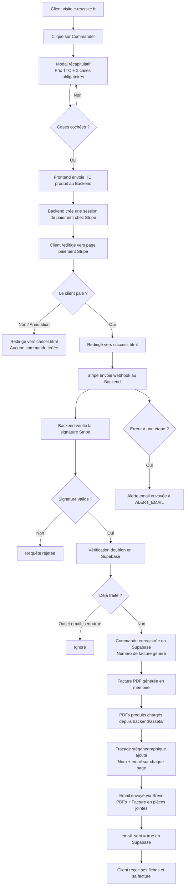

# C'Réussite — Documentation complète du site

> Ce document explique comment fonctionne le site C'Réussite, quels outils sont utilisés, comment les commandes sont traitées, et comment maintenir ou faire évoluer le projet. Il est rédigé pour une lecture sans connaissance technique particulière.
>
> Dernière mise à jour : 10 avril 2026

---

## Table des matières

1. [Vue d'ensemble en une phrase](#1-vue-densemble-en-une-phrase)
2. [Architecture globale](#2-architecture-globale)
3. [Stack technique — tableau récapitulatif](#3-stack-technique)
4. [Flux complet d'une commande](#4-flux-complet-dune-commande)
5. [Les produits](#5-les-produits)
6. [La livraison des produits](#6-la-livraison-des-produits)
7. [La facturation](#7-la-facturation)
8. [La base de données](#8-la-base-de-données)
9. [Exporter les commandes en Excel](#9-exporter-les-commandes-en-excel)
10. [Services externes et leurs coûts](#10-services-externes-et-leurs-coûts)
11. [Déploiement et maintenance](#11-déploiement-et-maintenance)
12. [Diagramme du flux de commande](#12-diagramme-du-flux-de-commande)
13. [FAQ](#13-faq)
14. [Recommandations prioritaires](#14-recommandations-prioritaires)

---

## 1. Vue d'ensemble en une phrase

Le site C'Réussite est une boutique en ligne qui vend des fiches de révision en PDF : le client paie en ligne via Stripe, et reçoit automatiquement ses fichiers par email dans les secondes qui suivent, sans aucune intervention manuelle.

---

## 2. Architecture globale

### Le frontend — ce que voit le client

Le site visible à l'adresse **c-reussite.fr** est un ensemble de pages HTML hébergées gratuitement sur **GitHub Pages**.

Pages existantes :
- `docs/index.html` — page d'accueil (hero, produits, avis, à propos, FAQ, contact)
- `docs/success.html` — page affichée après un paiement réussi
- `docs/cancel.html` — page affichée si le client annule
- `docs/cgv.html` — Conditions Générales de Vente
- `docs/cgu.html` — Conditions Générales d'Utilisation
- `docs/mentions-legales.html` — Mentions légales (SIRET et adresse à compléter)
- `docs/confidentialite.html` — Politique de confidentialité
- `docs/beta.html` — Formulaire beta-testeur (noindex, non référencé)
- `docs/admin.html` — Tableau de bord admin (protégé par `ADMIN_KEY`)

Structure de la page d'accueil (dans l'ordre) :
1. Hero — accroche BAC 2026, Terminale Spécialité
2. Les fiches — produits avec boutons Commander et Recevoir un extrait
3. Avis — témoignages avec swipe tactile
4. À propos — présentation de Camille Reinhardt (Polytechnicienne, Docteure en sciences)
5. FAQ — 8 questions en accordéon cliquable
6. Contact — formulaire

### Le backend — le moteur invisible

Hébergé sur **Render**. Il gère : création de sessions de paiement Stripe, réception du webhook, enregistrement des commandes, génération de factures, envoi des emails, alertes en cas d'erreur, et envoi des extraits gratuits.

Routes disponibles :
- `POST /api/checkout` — crée une session de paiement Stripe
- `POST /webhook` — reçoit la confirmation de paiement Stripe
- `POST /api/extract` — envoie un extrait gratuit par email
- `POST /api/beta-feedback` — enregistre un avis beta-testeur dans Supabase
- `GET /api/products` — liste des produits (même source que le frontend)
- `GET /api/admin/orders` — liste des commandes (protégé par `ADMIN_KEY`)
- `GET /api/admin/export` — télécharge un CSV de toutes les commandes (protégé par `ADMIN_KEY`)
- `GET /api/admin/invoice/:num` — re-génère et télécharge une facture PDF (protégé par `ADMIN_KEY`)
- `GET /api/health` — health check simple
- `GET /api/healthz` — health check détaillé (vérifie variables d'environnement et alertes)

### Les autres services

| Service | Rôle |
|---|---|
| **Stripe** | Paiement sécurisé par carte bancaire |
| **Supabase** | Base de données (stockage des commandes) |
| **Brevo** | Envoi de tous les emails (commandes, extraits, alertes ops) |
| **PDFKit** | Génère la facture PDF à la volée |
| **pdf-lib** | Ajoute le traçage stéganographique sur les PDFs produits et extraits |
| **GitHub Pages** | Héberge le site visible |
| **Render** | Héberge le backend |

---

## 3. Stack technique

| Composant | Rôle | Fichier | Gratuit aujourd'hui ? | Peut devenir payant ? | Remarque |
|---|---|---|---|---|---|
| JavaScript (Node.js) | Langage du backend | `backend/` | Oui | Non | Standard |
| HTML / CSS / JS | Langage du frontend | `docs/` | Oui | Non | Pas de framework |
| Express.js | Cadre du serveur backend | `backend/server.js` | Oui | Non | Open source |
| Stripe | Paiement par carte | `backend/routes/checkout.js` | Commission 2,9% + 0,30€/transaction | Toujours à l'usage | Incontournable |
| Supabase | Base de données | `backend/services/db.js` | Oui (plan gratuit) | Oui au-delà de 500 Mo | Très généreux pour démarrer |
| Brevo | Envoi d'emails + alertes | `backend/services/mailer.js`, `alerts.js` | Oui (300 emails/jour) | Oui si dépassement | Suffisant au démarrage |
| PDFKit | Génération facture PDF | `backend/services/invoice.js` | Oui | Non | Open source |
| pdf-lib | Traçage stéganographique des PDFs | `backend/services/mailer.js`, `extract.js` | Oui | Non | Open source |
| GitHub Pages | Hébergement site visible | `docs/` + `.github/workflows/` | Oui | Non | Très fiable |
| Render | Hébergement backend | `backend/` | Oui (plan free) | Gratuit (permanent) | |
| GitHub Actions | Déploiement automatique | `.github/workflows/deploy.yml` | Oui | Non | |
| Domaine c-reussite.fr | Adresse du site | `docs/CNAME` | Non (~10-15€/an) | Toujours payant | |

---

## 4. Flux complet d'une commande

| Étape | Ce qui se passe | Service | Données créées | Point de vigilance |
|---|---|---|---|---|
| 1. Clic sur "Commander" | Ouverture d'un modal récapitulatif | Frontend | Aucune | |
| 2. Modal pré-paiement | Le client voit le produit, le prix TTC, et doit cocher 2 cases obligatoires : renonciation au droit de rétractation + acceptation des CGV | Frontend | Aucune | Bouton désactivé tant que les deux cases ne sont pas cochées |
| 3. Demande de session | Après validation, le frontend envoie l'ID du produit au backend | Frontend → Backend | Aucune | Si backend hors ligne, alerte affichée |
| 4. Création session Stripe | Le backend crée une session de paiement chez Stripe | Backend → Stripe | Session Stripe créée | Le produit doit exister dans `products.json` |
| 5. Redirection Stripe | Le client est redirigé vers la page de paiement sécurisée Stripe | Stripe | Aucune | Les données bancaires ne touchent jamais le backend |
| 6. Paiement | Le client saisit sa carte sur Stripe | Stripe | Aucune | La banque peut refuser |
| 7. Résultat | Si validé → `success.html`. Si annulé → `cancel.html` | Stripe → Frontend | Aucune en base | |
| 8. Webhook Stripe | Stripe envoie une notification secrète au backend | Stripe → Backend | Aucune encore | Stripe retentera si le backend ne répond pas |
| 9. Vérification signature | Le backend vérifie que la notification vient bien de Stripe | Backend | Aucune | Protection contre les faux paiements |
| 10. Vérification doublon | Le backend vérifie si cette session existe déjà en base | Backend → Supabase | Lecture seule | Protège contre les doubles livraisons |
| 11. Enregistrement commande | Insertion en base : email, produit, montant, numéro de facture | Backend → Supabase | Ligne créée dans `orders` | Numéro au format `2026-001` |
| 12. Génération facture | PDF de facture créé en mémoire (non sauvegardé sur disque) | Backend (PDFKit) | PDF temporaire | Non archivé — voir recommandations |
| 13. Traçage stéganographique | Nom + email de l'acheteur inscrits invisiblement sur chaque page des PDFs produits | Backend (pdf-lib) | PDF modifié en mémoire | Les fichiers sources dans `backend/assets/` ne sont pas modifiés |
| 14. Envoi email | Email envoyé avec PDFs produits + facture en pièces jointes | Backend → Brevo | Email envoyé | Si Brevo indisponible, backend répond 500 → Stripe retentera |
| 15. Marquage email_sent | Le champ `email_sent` passe à `true` en base | Backend → Supabase | `email_sent = true` | Empêche les doubles livraisons sur retry Stripe |
| 16. Archivage facture | Le PDF de facture est uploadé dans Supabase Storage (bucket "invoices") | Backend → Supabase Storage | PDF dans `invoices/2026/2026-001.pdf` + chemin en base | Non bloquant : ignoré si le bucket n'existe pas |
| 17. Alerte ops si erreur | Si une erreur survient, un email d'alerte est envoyé à `ALERT_EMAIL` | Backend → Brevo | Aucune | Nécessite que `ALERT_EMAIL` soit configuré dans Render |

### Ce qui se passe si le paiement échoue
Stripe ne déclenche pas de webhook. Aucune commande n'est créée. Le client est renvoyé vers `cancel.html`.

### Ce qui se passe si Stripe envoie deux fois la même notification
Double protection : le champ `stripe_session_id` est UNIQUE en base (empêche les doublons), et `email_sent = true` après le premier envoi réussi (empêche les doubles livraisons). Le client ne reçoit qu'un seul email.

---

## 5. Les produits

Le fichier `docs/content/products.json` est **la seule source de vérité**. Il est lu par le frontend ET le backend.

### Catalogue actuel

| Produit | ID | Prix | PDFs livrés | Extraits gratuits |
|---|---|---|---|---|
| Fiches Maths Terminale Spécialité | `maths` | 14,99 € | `fiches-maths.pdf` | `extrait-maths.pdf` |
| Fiches Physique-Chimie Terminale Spécialité | `physique` | 14,99 € | `fiches-physique-chimie.pdf` | `extrait-physique-chimie.pdf` |
| Pack Maths + Physique-Chimie | `bundle` | 24,99 € | `fiches-maths.pdf` + `fiches-physique-chimie.pdf` | `extrait-maths.pdf` + `extrait-physique-chimie.pdf` |

> Le prix est en **centimes** dans le fichier JSON : `1499` = 14,99 €.

### Comment modifier le catalogue sans casser le site

| Action | Ce qu'il faut faire | Risque si mal fait |
|---|---|---|
| Changer le prix | Modifier `price` dans `products.json` (en centimes) | Le client paie le mauvais prix |
| Changer le nom | Modifier `name` dans `products.json` | Le nom sur la facture change aussi |
| Ajouter un produit | Ajouter un objet JSON avec `id`, `name`, `price`, `pdf_files`, `extract_files` | Si les PDFs sont absents de `backend/assets/`, l'email échoue |
| Ajouter un PDF produit | Déposer le fichier dans `backend/assets/` ET l'ajouter dans `pdf_files` | Si absent, l'email échoue |
| Ajouter un extrait | Déposer le fichier dans `backend/assets/` ET l'ajouter dans `extract_files` | Si absent, le bouton "Recevoir un extrait" renvoie une erreur |

> Ne jamais changer l'`id` d'un produit existant : les anciennes commandes en base y font référence.

---

## 6. La livraison des produits

### Après achat (automatique)

| Type | Déclencheur | Service | Ce que reçoit le client |
|---|---|---|---|
| PDFs produit(s) | Paiement Stripe validé | Brevo | PDF(s) avec traçage stéganographique invisible |
| Facture PDF | Même déclencheur | Brevo | Facture numérotée `facture-2026-001.pdf` |

L'email contient : produit acheté, prix TTC, date, numéro de facture, mention de renonciation au droit de rétractation, liens CGV et confidentialité. Une copie est envoyée en BCC à `BCC_EMAIL`.

### Extrait gratuit (automatique)

Quand un visiteur saisit son email dans le popup "Recevoir un extrait", le backend envoie directement le fichier extrait via Brevo. Aucune intervention manuelle. Le PDF extrait reçoit lui aussi un traçage stéganographique avec l'email du destinataire.

### La protection anti-partage (stéganographie)

Chaque PDF livré est modifié avant envoi. Le fichier est visuellement identique à l'original, mais le nom et l'email de l'acheteur y sont inscrits de façon invisible à deux niveaux :

**Niveau 1 — Métadonnées du fichier** (supprimables avec un outil en ligne)
- Champ "Auteur" : `Acheté par : Prénom Nom <email@exemple.com>`
- Champs "Mots-clés" et "Sujet" : nom et email de l'acheteur

**Niveau 2 — Stéganographie dans le contenu des pages** (résiste à la suppression des métadonnées)
- Nom + email inscrits **5 fois par page** en texte blanc, taille 4pt, opacité 0,4%
- Invisible à l'oeil nu et à l'impression
- Physiquement dans le flux de contenu PDF — aucun outil de "nettoyage" n'y touche
- Détectable via `Ctrl+A` dans Adobe Acrobat

**Pour identifier l'origine d'un fichier partagé illégalement** : ouvrir dans Adobe Acrobat, `Ctrl+A`, copier dans un éditeur — nom et email lisibles 5 fois par page. Croiser avec la table `orders` dans Supabase.

### Et si l'acheteur a utilisé un faux nom ou une fausse adresse email ?

Le vrai identifiant d'un acheteur, c'est sa carte bancaire. Stripe conserve pour chaque transaction :

| Donnée | Fiable ? | Falsifiable ? |
|---|---|---|
| Email saisi | Non | Oui — alias, Yopmail |
| Nom saisi | Non | Oui — champ libre |
| 4 derniers chiffres de la carte | Oui | Non |
| Nom du titulaire de carte | Oui | Très difficile |
| Adresse de facturation | Oui | Partiellement |
| Empreinte unique de la carte (`fingerprint`) | Oui | Non |

Même avec un faux nom et un faux email, les coordonnées bancaires dans Stripe sont suffisantes pour une mise en demeure ou un signalement.

---

## 7. La facturation

| Élément | Détail | Généré par | Stocké où | Envoyé à qui |
|---|---|---|---|---|
| Numéro de facture | Format `AAAA-NNN` (ex: `2026-001`), séquentiel par année | Backend (`db.js`) | Supabase (`invoice_number`) | Corps + pièce jointe de l'email |
| Nom du vendeur | "C'Réussite" | Backend (`invoice.js`) | Non stocké | PDF facture |
| Site web | `c-reussite.fr` | Backend (`invoice.js`) | Non stocké | PDF facture |
| Facturé à | Email de l'acheteur | Backend | Non stocké séparément | PDF facture |
| Désignation | Nom du produit | Backend | Non stocké séparément | PDF facture |
| Prix TTC | Montant en euros | Backend | En centimes dans Supabase | PDF facture |
| Mention TVA | "TVA non applicable – article 293 B du CGI" | Backend | Non stocké | PDF facture |
| Mention acquittement | "Facture acquittée" | Backend | Non stocké | PDF facture |

La facture est générée **en mémoire** à chaque commande, puis jointe à l'email. Elle est ensuite archivée dans Supabase Storage (bucket "invoices", organisation `AAAA/AAAA-NNN.pdf`). Le chemin d'accès est sauvegardé dans la colonne `invoice_path` en base. Depuis le tableau de bord admin, il est possible de re-télécharger n'importe quelle facture à tout moment via le bouton "PDF" (la facture est re-générée depuis les données en base).

---

## 8. La base de données

Une seule table : `orders`.

### Structure de la table `orders`

| Champ | Rôle | Type | Obligatoire ? | Pourquoi c'est important |
|---|---|---|---|---|
| `id` | Identifiant unique de la commande | UUID (automatique) | Oui | Identifier chaque commande |
| `email` | Email de l'acheteur | Texte | Oui | Retrouver les commandes d'un client |
| `product_id` | Identifiant du produit | Texte | Oui | Savoir ce qui a été acheté |
| `amount` | Montant payé en centimes | Entier | Oui | Comptabilité |
| `stripe_session_id` | Identifiant unique Stripe | Texte UNIQUE | Oui | Empêche les doublons en base |
| `invoice_number` | Numéro de facture (ex: `2026-001`) | Texte | Oui | Numérotation comptable |
| `email_sent` | L'email a-t-il été envoyé ? | Booléen (défaut: false) | Oui | Empêche les doubles livraisons sur retry Stripe |
| `invoice_path` | Chemin du PDF archivé dans Supabase Storage | Texte (nullable) | Non | Ex: `2026/2026-001.pdf` — null si l'archivage a échoué |
| `created_at` | Date et heure de la commande | Date avec fuseau | Oui (automatique) | Exports et comptabilité |

Index existants : sur `email`, `stripe_session_id`, `invoice_number`, et un index partiel sur `email_sent = false` (pour retrouver rapidement les commandes non livrées).

Les données ne sont **jamais effacées automatiquement**. Les sauvegardes automatiques Supabase (7 jours) permettent uniquement de restaurer la base en cas de fausse manipulation — elles ne suppriment pas les données existantes.

---

## 9. Tableau de bord admin et export des commandes

### Tableau de bord admin

La page `docs/admin.html` (accessible à l'adresse `c-reussite.fr/admin.html`) est un tableau de bord protégé par mot de passe (`ADMIN_KEY`).

**Fonctionnalités :**
- **Connexion** : saisie de la clé d'accès (`ADMIN_KEY`, configurée dans Render)
- **Stats** : nombre de commandes, chiffre d'affaires total, emails envoyés, commandes en attente
- **Tableau** : toutes les commandes (N° facture, date, email, produit, montant, statut email)
- **Filtre par année** : pour ne voir qu'une année donnée
- **Export CSV** : télécharge un fichier `.csv` compatible Excel (BOM UTF-8, ouvre correctement)
- **Téléchargement facture** : bouton "PDF" par ligne, re-génère la facture depuis la base
- **Déconnexion** : supprime la clé du localStorage

La clé est mémorisée dans le navigateur entre les sessions (localStorage). Pour se déconnecter depuis n'importe quel appareil, utiliser le bouton "Déconnexion".

### Export CSV depuis le tableau de bord

1. Aller sur `c-reussite.fr/admin.html`
2. Saisir la clé d'accès
3. Optionnel : sélectionner une année dans le filtre
4. Cliquer "Exporter CSV"
5. Le fichier `commandes.csv` (ou `commandes-2026.csv`) se télécharge — ouvrir dans Excel

### Export manuel via Supabase (sans code)
1. Aller sur [supabase.com/dashboard](https://supabase.com/dashboard)
2. Ouvrir le projet C'Réussite
3. Table Editor → table `orders` → bouton Export → CSV

### Requête SQL directe

Dans Supabase, **SQL Editor** :

```sql
SELECT
  invoice_number  AS "N° Facture",
  created_at      AS "Date",
  email           AS "Email client",
  product_id      AS "Produit",
  amount / 100.0  AS "Montant (€)",
  email_sent      AS "Email envoyé"
FROM orders
ORDER BY created_at DESC;
```

Pour filtrer par année :
```sql
SELECT * FROM orders
WHERE EXTRACT(YEAR FROM created_at) = 2026
ORDER BY created_at DESC;
```

---

## 10. Services externes et leurs coûts

| Service | À quoi il sert | Gratuit aujourd'hui ? | Limites | Peut devenir payant ? | Impact si changement |
|---|---|---|---|---|---|
| **Stripe** | Paiement par carte | Non — 2,9% + 0,30€/transaction | Aucune limite volume | Toujours à l'usage | Refaire toute l'intégration paiement |
| **Brevo** | Emails transactionnels + alertes ops | Oui — 300 emails/jour | 9 000/mois | Oui si dépassement | Modifier `mailer.js`, `extract.js`, `alerts.js` |
| **Supabase** | Base de données | Oui — plan Free | 500 Mo, sauvegardes 7 jours | Oui — ~25$/mois (plan Pro) | Migrer les données, modifier `db.js` |
| **Render** | Hébergement backend | Oui — plan free | Aucune limite | Non | Permanent et gratuit |
| **GitHub Pages** | Hébergement site visible | Oui | Bande passante raisonnable | Très peu probable | Modifier DNS et déploiement |
| **GitHub Actions** | Déploiement automatique | Oui | 2 000 min/mois | Peu probable | Gérable facilement |
| **Domaine c-reussite.fr** | Adresse web | Non (~10-15€/an) | — | Toujours payant | Mettre à jour les URLs partout |

**Total fixe mensuel estimé : ~1,25€/mois** (domaine uniquement) hors commissions Stripe.

---

## 11. Déploiement et maintenance

### Comment le site est mis à jour

Tout push sur la branche `main` de GitHub déclenche automatiquement :
- **Frontend** : déploiement GitHub Pages via GitHub Actions
- **Backend** : redéploiement Render via GitHub Actions (`.github/workflows/deploy-render.yml`) — uniquement si `backend/**` ou `docs/content/products.json` est modifié
- **Migrations DB** : application automatique par Supabase (intégration GitHub)

### Variables d'environnement (stockées dans Render)

| Variable | À quoi elle sert |
|---|---|
| `STRIPE_SECRET_KEY` | Créer les sessions de paiement Stripe |
| `STRIPE_WEBHOOK_SECRET` | Vérifier les notifications Stripe |
| `SUPABASE_URL` | Adresse de la base de données |
| `SUPABASE_SERVICE_ROLE_KEY` | Accès complet à la base de données |
| `BREVO_API_KEY` | Envoyer les emails via Brevo |
| `FROM_EMAIL` | Adresse expéditeur des emails |
| `FROM_NAME` | Nom affiché dans l'expéditeur (ex: "C'Réussite") |
| `ALERT_EMAIL` | Adresse qui reçoit les alertes en cas d'erreur backend |
| `BCC_EMAIL` | Adresse en copie cachée de chaque email de commande et d'extrait |
| `ADMIN_KEY` | Clé d'accès au tableau de bord admin (`/admin.html`) — choisir une valeur longue et aléatoire |

### Health checks

- `/api/health` — réponse simple `{"status":"ok"}`
- `/api/healthz` — vérifie que toutes les variables d'environnement requises sont présentes et si les alertes sont configurées. Renvoie `503` si une variable manque.

### Alertes automatiques

Le service `backend/services/alerts.js` envoie un email d'alerte à `ALERT_EMAIL` via Brevo dès qu'une erreur survient dans le traitement d'une commande. L'email contient : le message d'erreur, l'ID de session Stripe, l'email client, le produit, le montant et l'ID d'événement Stripe. Sans `ALERT_EMAIL` configuré dans Render, l'alerte est ignorée silencieusement (erreur visible uniquement dans les logs du dashboard Render).

### Tests automatisés

| Fichier | Ce qu'il teste | Credentials requis ? |
|---|---|---|
| `tests/invoice.test.js` | Génération facture PDF | Non |
| `tests/webhook.test.js` | Logique commande + idempotence | Partiellement |
| `tests/checkout.test.js` | Création session Stripe | Oui (skippé sans clé) |
| `tests/products.test.js` | Validité du catalogue JSON | Non |

Lancer les tests : `cd backend && npm test`

### Ce qui manque pour fiabiliser davantage

- Créer le bucket "invoices" dans Supabase Storage (étape manuelle — sans cela, l'archivage est ignoré silencieusement)

---

## 12. Diagramme du flux de commande



---

## 13. FAQ

**Est-ce que le site vend vraiment automatiquement ?**
Oui, entièrement. De l'enregistrement de la commande à l'envoi de l'email avec les fichiers, tout est automatique. 24h/24, 7j/7, sans intervention manuelle.

---

**Où vont les paiements ?**
Directement sur le compte Stripe de C'Réussite. Stripe prélève sa commission (2,9% + 0,30€/transaction) et verse le reste sur le compte bancaire lié, selon la fréquence configurée dans le tableau de bord Stripe.

---

**Comment sait-on qu'une commande est valide ?**
Une commande n'est enregistrée que si Stripe a confirmé le paiement via webhook ET si la signature cryptographique est valide. Un faux paiement ne peut pas déclencher de livraison.

---

**Le client doit-il accepter quelque chose avant de payer ?**
Oui. Un modal s'affiche avant la redirection vers Stripe avec deux cases obligatoires (non cochées par défaut) : renonciation au droit de rétractation et acceptation des CGV. Le bouton de paiement reste désactivé tant que les deux cases ne sont pas cochées.

---

**Peut-on ajouter un nouveau produit facilement ?**
Oui. Modifier `docs/content/products.json`, déposer les PDFs dans `backend/assets/`, pousser sur GitHub. Le site se met à jour automatiquement.

---

**Peut-on exporter toutes les commandes ?**
Oui. Depuis le tableau de bord admin (`/admin.html`), cliquer "Exporter CSV" — un fichier téléchargeable s'ouvre directement dans Excel. Voir section 9 pour d'autres méthodes.

---

**Que se passe-t-il si Stripe envoie deux fois le même webhook ?**
Double protection : le champ `stripe_session_id` est UNIQUE en base (empêche les doublons), et `email_sent = true` après le premier envoi réussi (empêche les doubles livraisons). Le client ne reçoit qu'un seul email.

---

**Est-ce que je suis prévenue si quelque chose casse ?**
Oui, si la variable `ALERT_EMAIL` est configurée dans Render. En cas d'erreur dans le traitement d'une commande, un email d'alerte est envoyé automatiquement avec tous les détails (session Stripe, email client, produit, message d'erreur). Sans `ALERT_EMAIL`, l'erreur est seulement visible dans les logs du dashboard Render.

---

**Que se passe-t-il si Brevo ou Supabase tombe en panne ?**
Si Brevo est indisponible : le backend répond 500 à Stripe, qui retentera automatiquement. Le client reçoit son email avec un léger retard.
Si Supabase est indisponible : même mécanisme. La commande sera traitée dès le retour du service.

---

**Quels outils sont payants à terme ?**
- Stripe : toujours à l'usage (commission par vente) — inévitable
- Domaine : ~10-15€/an — inévitable
- Render : gratuit (free tier permanent, pas de limite temporelle)
- Brevo : peut devenir payant si envois > 9 000/mois
- Supabase : peut devenir payant si données > 500 Mo

Pour le volume actuel d'une micro-entreprise débutante, le coût mensuel fixe est quasi nul (hors commissions Stripe).

---

**Qui doit intervenir si quelque chose casse ?**
- Site ne s'affiche plus : vérifier GitHub Pages
- Paiement ne fonctionne plus : vérifier Render + variables d'environnement
- Emails ne partent plus : vérifier Brevo (quota ?) et logs du dashboard Render
- Base inaccessible : vérifier tableau de bord Supabase
- Intervention sur le code : un développeur web Node.js

---

## 14. Recommandations prioritaires

| Priorité | Recommandation | Bénéfice | Difficulté | Urgence |
|---|---|---|---|---|
| 1 | **Configurer `ALERT_EMAIL` dans Render** | Être prévenue immédiatement si une commande échoue | Faible — juste ajouter la variable dans Render | Haute — le code est prêt, il manque juste la variable |
| 2 | **Déposer les extraits PDF** (`extrait-maths.pdf`, `extrait-physique-chimie.pdf`) dans `backend/assets/` | Le bouton "Recevoir un extrait" fonctionne vraiment | Zéro développement — juste déposer les fichiers | Haute |
| 3 | **Compléter les mentions légales** (SIRET et adresse dans `mentions-legales.html`) | Conformité légale | Zéro développement | Haute |
| 4 | **Configurer `BCC_EMAIL` dans Render** | Recevoir une copie de chaque email de commande | Faible — juste ajouter la variable dans Render | Moyenne |
| 5 | ~~**Archiver les factures**~~ **FAIT** — Supabase Storage bucket "invoices" | Retrouver et télécharger une facture depuis l'admin | — | Créer le bucket "invoices" dans Supabase (manuel) |
| 6 | ~~**Export automatique des commandes**~~ **FAIT** — route `/api/admin/export` + bouton dans l'admin | Télécharger les commandes en un clic depuis `/admin.html` | — | — |
| 7 | ~~**Tableau de bord admin**~~ **FAIT** — `docs/admin.html` | Voir commandes, CA, statut emails, télécharger factures | — | Configurer `ADMIN_KEY` dans Render |
| 8 | **Ajouter les tests en CI** | Détecter un bug avant qu'il arrive en production | Faible | Faible |

---

*Document maintenu à jour avec chaque modification du code. Dernière synchronisation : 10 avril 2026 — archivage factures, export CSV, tableau de bord admin.*
